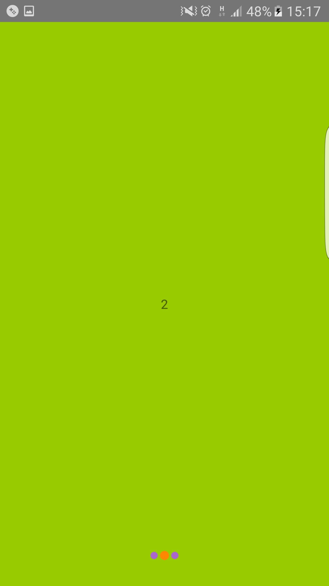

# Simple View Pager

View Pager for Android simple and easy to use, compatible with API 16+(Android 4.1) Apache License 2.0.

##Features

 - Any ViewGroup based View can be use as Container
 - Swipe Right and Left to swtich pages
 - Programmatically switch pages
 - Pages change cyclically
 - Auto Created PageDots
 - Customize style For Active PageDot and Deactive PageDosts
 - Customize PageDots location

##Screens and Demos

